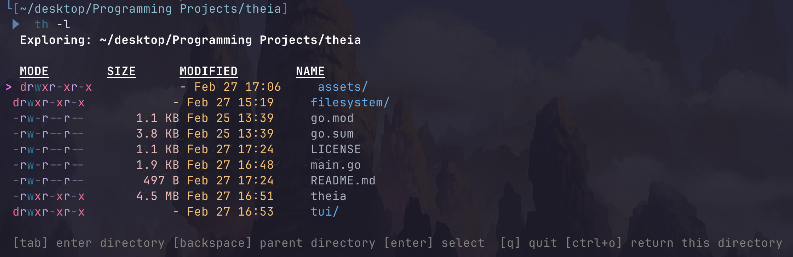

<div align="center">
    <a href="https://en.wikipedia.org/wiki/Theia">
        
    </a>
    <h1>Theia</h1>
    <a href="LICENSE"></a>
    <br />
    <br />
    <blockquote>
        <p><i>'Theia, the goddess of sight and brilliance'</i></p>
    </blockquote>
    <p><i>Theia</i> is a terminal based file explorer built with bubble tea.</p>
</div>

## How to use 

<div align="center">
    
</div>

Once installed you can use

```bash
th .
```
th with no flags lets you explore your file system and prints out your destination file/directory and puts the output to stdout. You can also list a path and start from that directory. 

```bash
th -l
```

This enables long view and shows more file info.

```bash 
th -a
```
Shows dotfiles
```bash 
th -cp
```
Copies the file path of your destination to your clipboard.

```bash 
th -cd
```
This cd's you into your destination directory. 

* Note: You can combine all of these flags if you want. 

## Naviagtion

You can navigate using arrow keys to cycle through files. 

Hit tab to explore a directory and backspace to go to the parent directory.

Click enter to select a final file path or ctrl+o to select the current directory you are exploring. 

## Installation

**Ensure [Golang](https://go.dev/) is installed**

1. Clone repository 
```bash 
git clone https://github.com/AP3008/theia.git 

cd theia

go build -o theia .

# Move to your system path
mv theia /usr/local/bin/
```
2. To enable the -cd flag
Add this snippet to ~/.zshrc or ~/.bashrc file

```bash
eval "$(theia --init)"
```
## LICENSE

[MIT](LICENSE)


